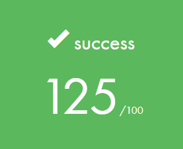
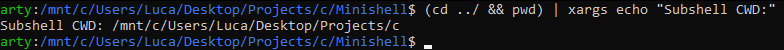

<h1 align="center">✨ Minishell ✨</h1>

<h6 align="center"><em>Standalone Unix C Bash Clone</em></h6>

## 📝 Overview

This project is a standalone Unix [Bash](https://www.gnu.org/software/bash/) clone made in C.<br>
It was developed as part of my study's curriculum in collaboration with a teammate.

View the project's requirements and guidelines here: [subject](./extra/en.subject.pdf)

The shell is written in C and compiled using the GNU17 C standard and the [clang](https://clang.llvm.org/) compiler. It is developed for Unix based platforms.

See it in action [here](#-showcase).

### Disclaimers

Please note that the project required the use of [Norminette](https://github.com/42school/norminette), a code styling guide. This severely hinders the code base and forced us to write poorly maintainable code, you can read further here: [en.norm.pdf](https://github.com/42school/norminette/blob/master/pdf/en.norm.pdf). Unfortunately, this is a requirement, I'm personally strictly against this styling standard.

We completed the bonus section as well, though, the subject requires us to split the bonus sources from the mandatory ones and create a [Makefile](./Makefile) `bonus` compilation rule. I stripped this, and instead combined all sources into a single binary.

I removed the norminette-required banners. These are banners which allows the school to view who created and last updated a file. They're required by norminette in order to pass. I stripped these from the project for the sake of privacy.

My [Libft](https://github.com/DontCallMeLuca/Libft) was used for this project. I added it as a git submodule, it could be that some minor things have changed, since it received updates since this project was concluded.

#### This project is not maintained.

### Results

| Evaluation Score |
|:----------------:|
|  |

<h6><em>The bonus for this project, along with three 'Outstanding'<br>evaluation scores, earned us an additional 25 points.</em></h6>

## ✨ Features

- Exact Bash behavior
- Signal handling
- Heredoc handling
- Logic gate handling
- Subshell handling
- Pipe handling
- Redirection handling
- Environment handling
- Working Builtins
- Fully working history
- Wildcard handling

## 🚀 Installation

### 🎉 Precompiled

To avoid compiling from source,<br>
download a precompiled version here:

| Release | Binary |
|:--------|:-------|
| 1.0 | [minishell](https://github.com/DontCallMeLuca/Minishell/releases/download/v1.0/minishell) |

### 🌐 Requirements

- Any Unix platform
- [gcc](https://gcc.gnu.org/) or [clang](https://clang.llvm.org/)
- [make](https://www.gnu.org/s/make/manual/make.html)
- [readline](https://tiswww.case.edu/php/chet/readline/rltop.html)

### ⭐ Getting Started

1. Clone the repository:

```sh
git clone https://github.com/DontCallMeLuca/Minishell.git
```

2. cd into it:

```sh
cd Minishell
```

### ⚙ Makefile

The project is compiled using [make](https://www.gnu.org/s/make/manual/make.html):

#### Build Release

```sh
make all
```

#### Clean Build

```sh
make clean
```

#### Delete Build

```sh
make fclean
```

#### Rebuild

```sh
make re
```

## 💻 Usage

### ✨ Quick Start

Running minishell is as easy as:

```sh
./minishell
```

From there, use it as you would a regular shell.

Note that extensive syntax features like `\` or `;` are not<br>
implemented as these are strictly forbidden by the subject.

For the implemented features, the behavior replicates that of Bash exactly.

## 🌌 Showcase

| Running Minishell |
|:-----------------:|
|  |
| <b>Pipes & Redirection</b> |
|  |
| <b>Logic Gates</b> |
|  |
| <b>Signal Handling</b> |
|  |
| <b>Wildcards</b> |
|  |
| <b>Shell Level</b> |
|  |
| <b>Subshell Handling</b> |
|  |
| <b>Quotes Handling</b> |
|  |
| <b>Exit Status Handling</b> |
|  |
| <b>Running Without an Environment</b> |
|  |
| <b>Heredoc</b> |
|  |

## ⚠ Limitations

- Unix only
- gcc and clang only
- Not very optimized
- Limited set of features

## 📃 License

This project uses the `GNU GENERAL PUBLIC LICENSE v3.0` license
<br>
For more info, please find the `LICENSE` file here: [License](LICENSE)
